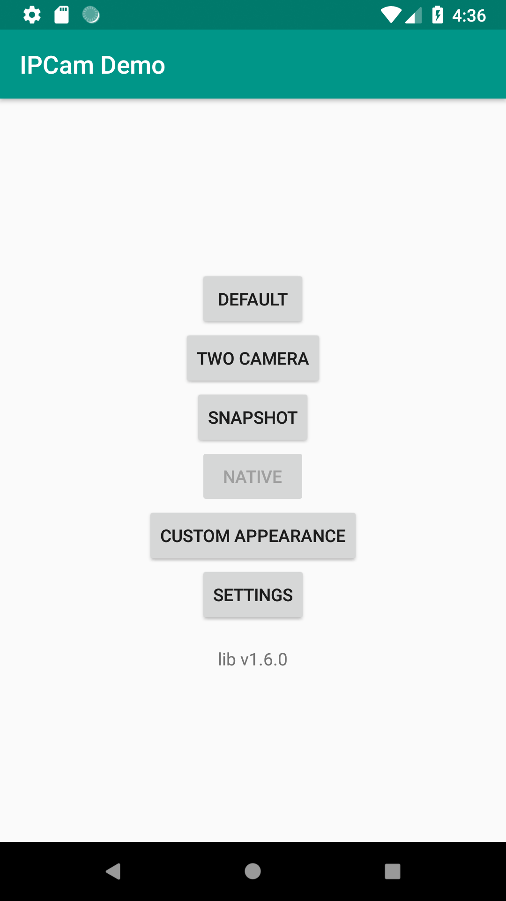
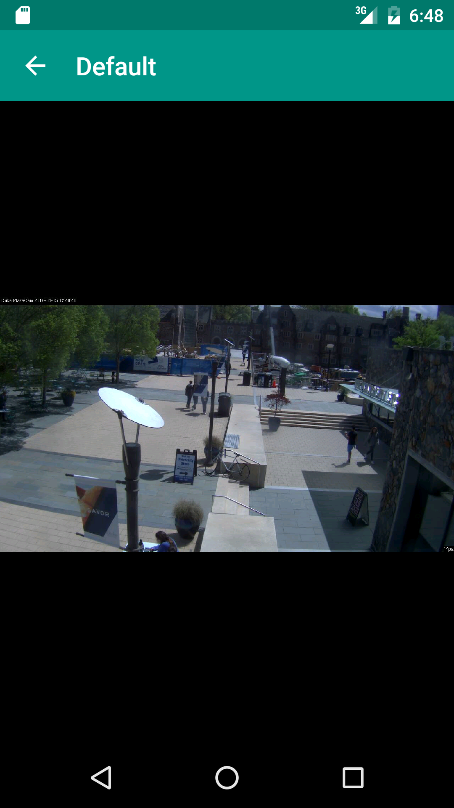
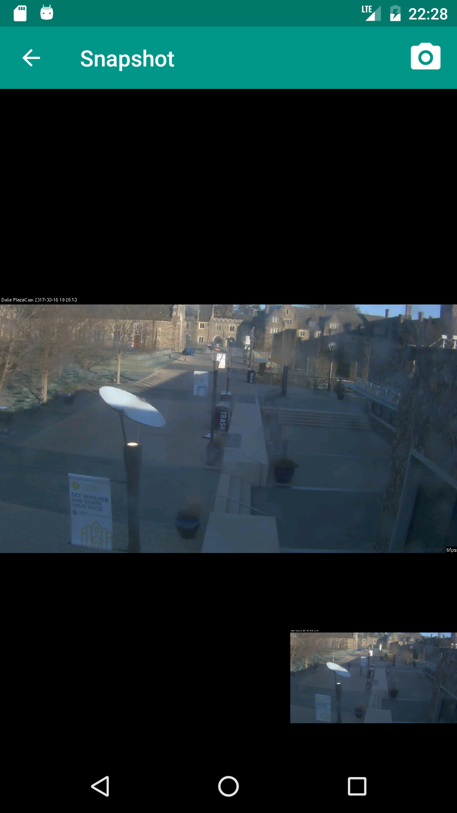
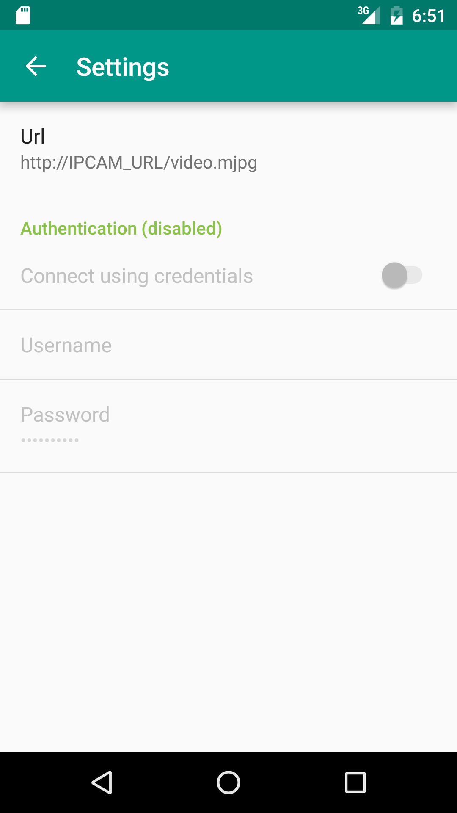

# ipcam-view 

[](http://android-arsenal.com/details/1/3358)
[](https://bintray.com/niqdev/maven/mjpeg-view/_latestVersion)

Android MJPEG video streaming made simple!

A wrapper library around the well known [SimpleMjpegView](https://bitbucket.org/neuralassembly/simplemjpegview) and [android-camera-axis](https://code.google.com/archive/p/android-camera-axis/) projects.

If you have problem to identify your IpCam url, please follow this [link](https://github.com/niqdev/ipcam-view/wiki)

### Features
- [x] Default support by `android-camera-axis`
- [ ] Native support by `SimpleMjpegView`
- [x] Handle credentials
- [x] Multiple camera in one activity
- [x] Snapshot
- [x] Flip image
- [ ] Video recording

### Demo app

 

 




<a href='https://play.google.com/store/apps/details?id=com.github.niqdev.ipcam&utm_source=global_co&utm_medium=prtnr&utm_content=Mar2515&utm_campaign=PartBadge&pcampaignid=MKT-Other-global-all-co-prtnr-ap-PartBadge-Mar2515-1'></a>

### Usage

Add to your layout: [example](app/src/main/res/layout/activity_ipcam_default.xml)
```java

<RelativeLayout
  xmlns:android="http://schemas.android.com/apk/res/android"
  // ADD THIS
  xmlns:stream="http://schemas.android.com/apk/res-auto"
  ...>

    <com.github.niqdev.mjpeg.MjpegSurfaceView
      android:id="@+id/VIEW_NAME"
      android:layout_width="match_parent"
      android:layout_height="match_parent"
      stream:type="stream_default OR stream_native" />

</RelativeLayout>
```

Read stream in your activity/fragment: [example](app/src/main/java/com/github/niqdev/ipcam/IpCamDefaultActivity.java)
```java
int TIMEOUT = 5; //seconds

Mjpeg.newInstance()
  .credential("USERNAME", "PASSWORD")
  .open("IPCAM_URL.mjpg", TIMEOUT)
  .subscribe(inputStream -> {
      mjpegView.setSource(inputStream);
      mjpegView.setDisplayMode(DisplayMode.BEST_FIT);
      mjpegView.showFps(true);
  });
```

### Gradle dependency
```
repositories {
    jcenter()
}
dependencies {
    compile 'com.github.niqdev:mjpeg-view:1.2.0'
}
```

### Apps that use this library
* [OpenWebNet Android](https://github.com/openwebnet/openwebnet-android)
* [TankDroid](https://github.com/bmachek/TankDroid)

You are welcome to add your app to the list!

### Development
Download Android NDK:
* [manually](http://developer.android.com/ndk/downloads/index.html#download)
* in Android Studio: File > Other Settings > Default Project Structure > download NDK 

Compile manually (verify your paths)
```bash
$ chmod a+x compileJni.sh
$ ./compileJni.sh
```
